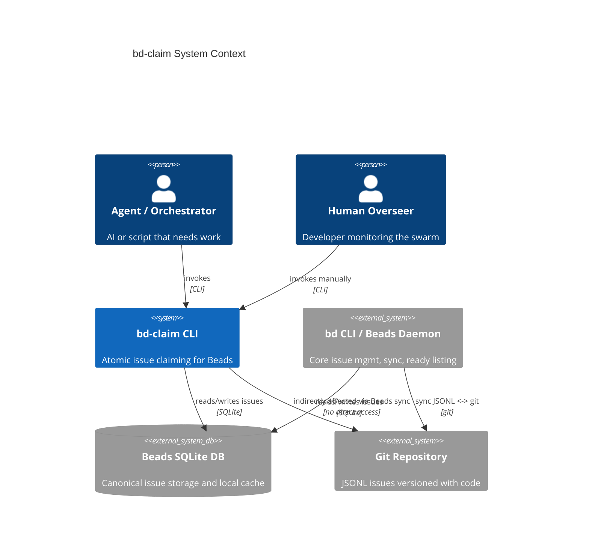
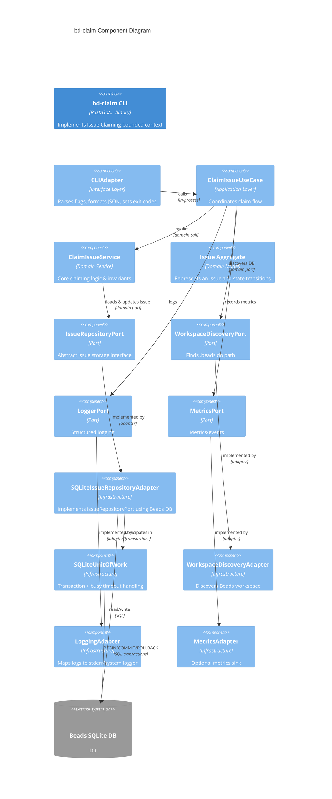

# Software Design Document (SDD) — `bd-claim`

## 1. Bounded Context Name & Core Domain Type

**Name:** Issue Claiming (bd-claim)
**Type:** Supporting Domain (core to Local Swarm operation, supporting Beads’ core Issue Management domain)

**Purpose:**
Provide a **Beads-native**, **locally atomic** “claim a ready issue” operation that multiple agents can safely use in parallel on a single `.beads` workspace without double-claiming the same issue.

---

## 2. Business Capabilities & Key Use Cases

### 2.1 Business Capabilities

This bounded context owns the following capabilities:

1. **Atomic Issue Claiming**

   * Select exactly one “ready” issue according to Beads semantics.
   * Transition it to a claimed state (`status = in_progress`, `assignee = <agent>`) atomically.
   * Guarantee: in a single Beads SQLite DB, **no two successful claims** return the same issue.

2. **Claim Filtering & Routing**

   * Restrict which issues are eligible for claim by:

     * Assignee (e.g., unassigned only),
     * Labels,
     * Priority,
     * Optional predicate extensions (future: components, tags, etc.).
   * Provide a simple mechanism for orchestrators to “shape” which work an agent can see without encoding DB details.

3. **Ready Predicate Compatibility**

   * Mirror/complement `bd ready` predicate:

     * Only open issues,
     * No blockers,
     * Not already in-progress.
   * Abstract the ready check behind a specification so internal logic can evolve while preserving contract.

4. **Stable Agent-Facing Contract**

   * Simple JSON-first CLI interface suitable for:

     * Direct agent usage,
     * Orchestrator scripts,
     * Tool integrations (e.g., AI coding environments).
   * Clear success vs. “no work” vs. error signaling.

5. **Concurrency-Safe DB Interaction**

   * Use SQLite transactions and locking in a way that:

     * Does not corrupt the Beads DB,
     * Minimizes lock contention with other `bd` and Beads daemon operations,
     * Avoids deadlocks and pathological lock storms.

6. **Operational Introspection**

   * Provide **inspectable**, human-runnable CLI behavior:

     * Humans can run `bd-claim` to debug swarm behavior,
     * Structured logs and error messages.

### 2.2 Key Use Cases

1. **UC-1: Single Agent Claims Work**

   * Trigger: Agent is idle and wants a task.
   * Flow:

     1. Agent runs `bd-claim --agent backend-1 --json`.
     2. System picks a ready issue, sets `status = in_progress`, `assignee = backend-1`.
     3. Returns issue in JSON.
   * Outcome: Agent gets exclusive ownership of that issue.

2. **UC-2: Multiple Agents Racing for Work**

   * Trigger: Multiple agents start concurrently and all call `bd-claim`.
   * Flow:

     1. Each invocation tries to atomically claim **one** ready issue.
     2. SQLite locking ensures serialized updates; losing contenders see zero updated rows and must retry or return `issue: null`.
   * Outcome: No duplicate claims; each claimed issue is assigned to exactly one agent.

3. **UC-3: No Work Available**

   * Trigger: Agent calls `bd-claim --agent test-agent`.
   * Flow:

     1. Query candidate ready issues with filters.
     2. None are available or claimable.
   * Outcome: Return `{ status: "ok", agent: "test-agent", issue: null }`.

4. **UC-4: Filtered Claim**

   * Trigger: Specialized agent that only wants certain labels.
   * Flow:

     1. Agent calls `bd-claim --agent infra-1 --label infra --priority high`.
     2. Only ready issues matching those filters are considered.
   * Outcome: Agent either gets a filtered issue or `issue: null`.

5. **UC-5: Human Debugging / Inspection**

   * Trigger: Overseer wants to verify claim behavior.
   * Flow:

     1. Run `bd-claim --agent debug-agent --json --dry-run`.
     2. See which issue would be claimed without committing mutations.
   * Outcome: Safe introspection of selection logic.

---

## 3. Context Boundary & Relationships (Context Map)

### 3.1 Upstream / Downstream Contexts

1. **Beads Issue Management (Upstream Context)**

   * Owns:

     * Canonical Issue model (fields: id, status, assignee, priority, labels, blockers, etc.).
     * Issue lifecycle transitions.
     * JSONL ↔ SQLite ↔ Git synchronization.
   * Relationship:

     * **Upstream / Downstream**: Issue Claiming is downstream; it **consumes** Beads’ issue data and mutates the canonical issue records via the shared SQLite DB.
     * Integration via shared DB and domain-conforming queries.
     * **Pattern**: Anti-Corruption Layer over shared database (DB-level ACL).

2. **Beads Daemon & CLI (Sibling/Partner Context)**

   * Owns:

     * `bd` CLI commands like `bd ready`, `bd update`.
     * Daemon that manages background sync, indexing.
   * Relationship:

     * Coexisting processes operating over the same DB and workspace.
     * Issue Claiming must respect daemon locking behavior and not disrupt it.
     * No code-level coupling; integration only via DB and filesystem.

3. **Agent / Orchestrator Context (External Consumer)**

   * Owns:

     * Agent lifecycle,
     * Multi-agent orchestration, scaling, higher-level scheduling.
   * Relationship:

     * **Customers** of Issue Claiming.
     * Integration via CLI (Issue Claiming exposes **Open Host Service** via command-line interface).
     * Agents treat `bd-claim` as a black-box “get work” API.

4. **Git Repository / Workspace Infrastructure (External Infra Context)**

   * Owns:

     * Git repo,
     * `.beads` directory layout,
     * CI/CD, versioning.
   * Relationship:

     * Issue Claiming auto-discovers `.beads` workspace and DB path based on current working directory.

### 3.2 Context Map Patterns

* **Anti-Corruption Layer (ACL)** between Issue Claiming domain and Beads Issue schema:

  * Domain models (`Issue`, `IssueStatus`, `LabelSet`) wrap raw DB rows.
  * No direct schema leakage to application or agent layers.

* **Shared Database Integration** (carefully controlled):

  * Although BD is anti-pattern in large distributed systems, here it’s **explicit and local** (single machine, one SQLite file).
  * We strictly confine raw SQL to infrastructure adapters.

* **Open Host Service**:

  * CLI command `bd-claim` acts as a stable service interface for agents/orchestrators.

---

## 4. High-Level Architecture (Hexagonal)

Architecture style: **Hexagonal (Ports & Adapters)**

### 4.1 Layers

1. **Domain Layer**

   * Pure business logic.
   * Contains:

     * Aggregates: `Issue`.
     * Value Objects: `IssueId`, `AgentName`, `IssueStatus`, `LabelSet`, `Priority`, `ClaimFilters`, `ReadySpecification`.
     * Domain Services: `ClaimIssueService`, `ReadyIssueSelector`.
     * Domain Events: `IssueClaimed`, `NoIssueAvailable`, `ClaimFailed`.

2. **Application Layer**

   * Orchestrates use cases.
   * Contains:

     * Use Case Handlers: `ClaimIssueUseCase`.
     * DTOs for request/response: `ClaimIssueRequest`, `ClaimIssueResult`.
     * Port interfaces:

       * `IssueRepositoryPort`
       * `WorkspaceDiscoveryPort`
       * `ClockPort`
       * `LoggerPort`
       * `MetricsPort`

3. **Infrastructure Layer**

   * Adapters for DB, filesystem, CLI IO, logging, metrics.
   * Components:

     * `SQLiteIssueRepositoryAdapter`
     * `SQLiteUnitOfWork`
     * `WorkspaceDiscoveryAdapter` (locates `.beads/beads.db`)
     * `CLIAdapter` (argument parsing, stdout/stderr, exit codes)
     * `LoggingAdapter`
     * `MetricsAdapter`
     * `ConfigAdapter` (env vars, flags)

4. **Interface Layer (CLI Frontend)**

   * Thin wrapper around Application layer.
   * Responsible for:

     * CLI flag parsing,
     * JSON serialization/deserialization,
     * Mapping CLI exit codes to `status` fields.

### 4.2 Key Architectural Decisions

* **Single Responsibility per Invocation**

  * Each `bd-claim` process handles exactly one claim attempt then exits.
  * No daemonization; keeps failure modes simple and predictable.

* **Transaction Per Request**

  * 1 claim attempt = 1 DB transaction.
  * Aligns naturally with CLI lifetime.

* **Optimistic + Pessimistic Concurrency**

  * Primary: use SQL `UPDATE … WHERE predicate LIMIT 1` inside a transaction for atomicity.
  * SQLite locking ensures only one updater at a time.
  * Retry/backoff logic for busy DB situations.

---

## 5. System Context Diagram (Mermaid)



---

## 6. Component Diagram (C4 Level 2–3, Mermaid)



---

## 7. Key Aggregates, Entities, Value Objects

### 7.1 Aggregates

**Aggregate: Issue**

* **Identity:** `IssueId`

* **Root:** `Issue`

* **Fields (as seen in this context, mapped from Beads):**

  * `id: IssueId`
  * `status: IssueStatus` (`open`, `in_progress`, `closed`, …)
  * `assignee: Option<AgentName>`
  * `priority: Priority` (e.g., `low`, `medium`, `high`, numeric weights)
  * `labels: LabelSet`
  * `blocked: bool` or `blocker_count: int`
  * `created_at: Timestamp`
  * `updated_at: Timestamp` (if present in Beads schema)

* **Invariants (within this context):**

  * A claim can only be applied if:

    * `status == open`
    * NOT blocked (`blocked == false` or equivalent)
    * `assignee` matches filter (e.g., unassigned or allowed pattern)
  * Claim transition:

    * Before: `status = open`, `assignee = any` (subject to filters)
    * After: `status = in_progress`, `assignee = AgentName(agent)`

* **Domain Behavior:**

  * `Issue.claim(agent: AgentName) -> IssueClaimed | ClaimRejected`

    * Validates invariants.
    * Returns domain event describing transition.
    * In practice, due to concurrent access, most invariants are enforced in persistence layer via `UPDATE … WHERE predicate`.

> Note: In this context, we do **not** own the lifecycle transitions beyond `open → in_progress`. Other transitions are managed by Beads Issue Management.

### 7.2 Entities

There are **no separate non-root entities** within this aggregate in this context; any substructures (e.g., checklist items) are opaque to Issue Claiming and not used in predicates.

### 7.3 Value Objects

1. **IssueId**

   * Underlying: string/UUID/int as provided by Beads.
   * Rules:

     * Opaque; no semantic operations beyond equality.

2. **AgentName**

   * Underlying: string.
   * Rules:

     * Non-empty, max length constraint (e.g., 64 chars).
     * Sanitized for logging (no control chars).

3. **IssueStatus**

   * Enumerated type: `open`, `in_progress`, `closed`, `blocked`, `archived`, etc.
   * Mapped from Beads’ status column.
   * Used for claim predicate and invariants.

4. **Priority**

   * Enumerated or numeric.
   * Used for ordering candidates and filtering.

5. **LabelSet**

   * Collection of label strings.
   * Provides methods like `contains(label)` and `matchesAny(labels)`.

6. **ClaimFilters**

   * Immutable object representing all filter options:

     * `only_unassigned: bool`
     * `include_labels: Set<String>`
     * `exclude_labels: Set<String>`
     * `min_priority: Option<Priority>`
   * Used by the selector to build predicates.

7. **ReadySpecification**

   * Encapsulates "ready" logic:
     * `status IN ('open', 'in_progress')` (per `beads` default).
     * `NOT EXISTS (SELECT 1 FROM blocked_issues_cache WHERE issue_id = id)`
   * Provides:
     * `sql_predicate_fragment()` for the repository.
     * `isSatisfiedBy(issue: Issue)` for defensive checks.

---

## 8. Domain Events

The Issue Claiming context defines domain events that represent notable outcomes. In the current CLI implementation, these are primarily:

1. **IssueClaimed**

   * **When:** An issue has been successfully claimed.
   * **Payload:**

     * `issueId: IssueId`
     * `agent: AgentName`
     * `claimedAt: Timestamp`
   * **Uses:**

     * Structured logging,
     * Metrics (`claims_success_total`),
     * Future integration with orchestration/monitoring systems.

2. **NoIssueAvailable**

   * **When:** No eligible issue is found for the given filters.
   * **Payload:**

     * `agent: AgentName`
     * `filters: ClaimFilters`
     * `checkedAt: Timestamp`
   * **Uses:**

     * Logging to understand idling behavior,
     * Metrics for utilization.

3. **ClaimFailed**

   * **When:** Claim attempt fails due to technical reasons:

     * DB connection failure,
     * SQLite busy timeout exceeded,
     * Beads workspace not found,
     * Schema incompatibility.
   * **Payload:**

     * `agent: Option<AgentName>`
     * `errorCode: ClaimErrorCode`
     * `errorMessage: String`
     * `occurredAt: Timestamp`
   * **Uses:**

     * Error logging,
     * Metrics (`claims_error_total`),
     * Alerting in automation.

---

## 9. Read Model / Query Strategy (CQRS)

### 9.1 CQRS Approach

Given the small scope and single operation, we adopt a **lightweight CQRS** pattern:

* **Command Side:**

  * Operation: `ClaimIssueCommand(agent, filters)`.
  * Implemented via:

    * `ClaimIssueUseCase` → `ClaimIssueService` → `IssueRepositoryPort`.

* **Query Side:**

  * We do not maintain a separate read model DB.
  * Queries operate directly against Beads’ SQLite, using:

    * `ReadySpecification` + `ClaimFilters` to build SQL predicates.

For observability/debugging, we may optionally expose a **read-only** mode (`--dry-run`) that:

* Executes the selection logic **without** the state change,
* Returns the candidate issue as read from DB without committing an update.

### 9.2 Selection Strategy

We must avoid scanning the entire issue set under contention while still preserving fairness where possible.

**Candidate Selection Rules:**

1. Apply ready predicate:

   * `status == 'open'`
   * `not blocked`
2. Apply filters:

   * `assignee IS NULL` if `only_unassigned`,
   * `labels @> include_labels` (or equivalent),
   * `labels !&& exclude_labels` (or equivalent),
   * `priority >= min_priority`.
3. Order candidates:

   * Default ordering:

     * `ORDER BY priority DESC, created_at ASC, id ASC`
   * Allows:

     * Prioritization of more important tasks,
     * Approximate FIFO within priority.

**Atomic Update Pattern (Command Side):**

Within a single transaction:

```sql
UPDATE issues
SET status = 'in_progress',
    assignee = :agent,
    updated_at = :now
WHERE id = (
  SELECT id
  FROM issues
  WHERE <ready predicate AND filters>
  ORDER BY priority DESC, created_at ASC, id ASC
  LIMIT 1
)
AND status = 'open'
-- optional: AND assignee IS NULL or matches filter
RETURNING *;
```

* If a row is returned:

  * Command success: we have a claimed issue.
* If zero rows:

  * Either no candidate existed or we lost a race; treat as `NoIssueAvailable` (optionally with retry).

This pattern inherently combines **read + write** in one round trip, preventing classic “select-then-update” race conditions.

---

## 10. API Design

### 10.1 Primary API: CLI Contract

**Command:** `bd-claim`

**Synopsis:**

```bash
bd-claim --agent <agent-name> [options]
```

**Required Flags:**

* `--agent <agent-name>`

  * Logical identifier of the agent/worker.
  * Used to set `assignee` in the issue.

**Optional Flags (Filters & Behavior):**

* `--label <label>` (repeatable)

  * Only consider issues containing these labels.
* `--exclude-label <label>` (repeatable)

  * Exclude issues containing these labels.
* `--min-priority <level>`

  * Minimum priority (e.g., `low`, `medium`, `high`, or numeric).
* `--only-unassigned`

  * Only consider issues where `assignee IS NULL`.
* `--workspace <path>`

  * Override auto-discovered workspace root (optional).
* `--db <path>`

  * Override auto-discovered SQLite DB path (for advanced users).
  * Matches `bd` CLI flag.
* `--dry-run`

  * Show which issue *would* be claimed without updating DB.
* `--json` (default)

  * JSON output (recommended for agents).
* `--pretty`

  * Pretty-print JSON.
* `--human`

  * Human-friendly single-line or multi-line output for humans.
* `--timeout-ms <N>`

  * Override DB busy timeout (default via config).
* `--log-level <level>`

  * Control verbosity.

**JSON Output Schema (Success):**

```json
{
  "status": "ok",
  "agent": "backend-1",
  "issue": {
    "id": "bd-7f3a",
    "status": "in_progress",
    "assignee": "backend-1",
    "priority": "high",
    "labels": ["backend", "api"],
    "title": "Implement bd-claim CLI",
    "content_hash": "sha256:...",
    "external_ref": null,
    "created_at": "<timestamp>",
    "updated_at": "<timestamp>"
  },
  "filters": {
    "only_unassigned": true,
    "include_labels": ["backend"],
    "exclude_labels": [],
    "min_priority": "medium"
  }
}
```

**JSON Output Schema (No Issue Available):**

```json
{
  "status": "ok",
  "agent": "backend-1",
  "issue": null,
  "filters": { ...same as above... }
}
```

**JSON Output Schema (Error):**

```json
{
  "status": "error",
  "agent": "backend-1",
  "issue": null,
  "error": {
    "code": "DB_NOT_FOUND" | "SCHEMA_INCOMPATIBLE" | "SQLITE_BUSY" | "WORKSPACE_NOT_FOUND" | "INVALID_ARGUMENT" | "UNEXPECTED",
    "message": "Human-readable explanation"
  }
}
```

### 10.2 Internal Application API

**Use Case Interface:**

```ts
interface ClaimIssueRequest {
  agent: AgentName;
  filters: ClaimFilters;
  dryRun: boolean;
  timeoutMs?: number;
}

interface ClaimIssueResult {
  status: "ok" | "error";
  agent: AgentName;
  issue: Issue | null;
  filters: ClaimFilters;
  error?: ClaimError;
}
```

**Port Interfaces:**

```ts
interface IssueRepositoryPort {
  claimOneReadyIssue(
    agent: AgentName,
    filters: ClaimFilters,
    readySpec: ReadySpecification,
    timeoutMs?: number
  ): Promise<Issue | null>;
}

interface WorkspaceDiscoveryPort {
  findWorkspaceRoot(cwd: string): Promise<string>; // path to repo root
  findBeadsDbPath(workspaceRoot: string): Promise<string>; // path to beads.db
}
```

---

## 11. Data Persistence Strategy

### 11.1 Storage Technology

* **SQLite** (the existing Beads DB):

  * Single file within `.beads` (e.g., `.beads/beads.db`).
  * Mode: WAL or as configured by Beads.
  * Shared with `bd` CLI and Beads daemon.

### 11.2 Schema Usage

We strictly operate on the following tables defined in `beads` (v0.27.0+):

*   **`issues`**
    *   `id` (TEXT PK)
    *   `status` (TEXT)
    *   `priority` (INTEGER)
    *   `assignee` (TEXT)
    *   `content_hash` (TEXT) - *Must be re-calculated on update*
    *   `external_ref` (TEXT)
    *   `source_repo` (TEXT)
*   **`blocked_issues_cache`**
    *   `issue_id` (TEXT PK)
    *   *Critical:* We must respect this cache for the "Ready" predicate.
*   **`dependencies`** (Read-only for claims)
    *   `issue_id`, `depends_on_id`, `type`
*   **`labels`**
    *   `issue_id`, `label`

**Views:**
*   **`ready_issues`** (Reference implementation, though we use the cache table for performance).

If new columns are added to these tables, we ignore them unless they affect the hash calculation. If critical columns (`status`, `assignee`) are missing or renamed, we emit `SCHEMA_INCOMPATIBLE`.

### 11.3 Transactions & Locking

**Transaction lifecycle:**

1. `BEGIN IMMEDIATE;`

   * Acquire a reserved lock early to prevent lock upgrade issues.
2. Execute `UPDATE … WHERE (SELECT … LIMIT 1)` as described earlier.
3. If 0 rows updated:

   * Optionally retry (limited) if due to race (`SQLITE_BUSY` or lost candidate).
   * Else treat as `NoIssueAvailable`.
4. `COMMIT;` on success, `ROLLBACK;` on error.

**Busy Timeout & Retry Policy:**

* Default `busy_timeout` (e.g., 1000–3000ms) set per connection.
* If `SQLITE_BUSY`:

  * Exponential backoff with jitter: e.g., 20ms, 40ms, 80ms up to configured maximum attempts (3–5).
  * On persistent contention:

    * Emit `ClaimFailed` with code `SQLITE_BUSY`.
    * Return error JSON.

### 11.4 Schema Evolution

* Adapter must be robust to minor schema changes:

  * Use `PRAGMA table_info(issues)` to discover column existence.
  * If new columns are added, we ignore them.
  * If critical columns (`status`, `assignee`) are missing or renamed:

    * Emit `SCHEMA_INCOMPATIBLE` error.
* No migrations are run by `bd-claim`; schema ownership remains with Beads.

---

## 12. Integration Patterns with Other Contexts

### 12.1 With Beads Issue Management

**Pattern:** Shared DB with Anti-Corruption Layer.

* The `SQLiteIssueRepositoryAdapter` :

  * Encapsulates raw SQL.
  * Maps DB records to domain `Issue`.
  * Builds predicates via `ReadySpecification` and `ClaimFilters`.
* All domain logic uses the domain model; no external code sees raw schemas.

**Considerations:**

* Must remain consistent with `bd ready` semantics:

  * Either re-use the same SQL view/function if exposed,
  * Or mirror its logic as closely as possible in `ReadySpecification`.

### 12.2 With Agents / Orchestrators

**Pattern:** Open Host Service (CLI).

* Agents treat `bd-claim` as a stateless “claim one issue” endpoint.
* Orchestrators can implement higher-level policies:

  * Round-robin agent creation,
  * Per-agent filtering strategies,
  * Quotas and fairness.

### 12.3 With Git / Workspace

* No direct integration.
* Indirect effects:

  * When issues are claimed, they become `in_progress` in DB and eventually in JSONL and Git via Beads daemon.
* `WorkspaceDiscoveryAdapter` ensures:

  * We only connect to valid `.beads` DB instances.
  * Avoids cross-repo confusion.

### 12.5 Relationship with bd CLI

`bd-claim` is a specialized companion to the `bd` CLI. It adheres to the same data model and database locking semantics.

*   **Reference Documentation:** See `../../vendor/beads/docs/CLI_REFERENCE.md` for definitive `bd` CLI behavior, flags, and concepts.
*   **Sync Responsibility:** `bd-claim` operates only on the local SQLite database. It does not automatically push changes to Git/Remotes. Agents or users are responsible for running `bd sync` (as recommended in `CLI_REFERENCE.md`) at appropriate intervals (e.g., end of session) to propagate claims to the rest of the team.
*   **Flag Consistency:** Where possible, `bd-claim` mirrors `bd` flags (e.g., `--db`, `--json`).

---

## 13. Scalability, Performance & Reliability Strategy

### 13.1 Scalability (Local Swarm)

Target: **5–10 concurrent agents** per workspace, up to thousands of issues.

Strategies:

1. **Efficient SQL**

   * Indexes:

     * Ensure indexes on `(status, priority, created_at)` or similar.
     * If not guaranteed, `bd-claim` may log a warning but will still operate.
   * Use `LIMIT 1` with sensible order to avoid scanning.

2. **Short-Lived Connections**

   * Each invocation opens a connection, performs a single transaction, and closes.
   * Minimizes long-lived lock holders.

3. **Backoff on Contention**

   * Exponential backoff to avoid thundering herds when many agents start simultaneously.

4. **Configurable Timeouts**

   * `--timeout-ms` allows tuning per environment.

### 13.2 Performance

* Expected latency per claim:

  * Typical: < 50–100ms on dev machine.
* Optimizations:

  * Prepared statements reused across invocations when runtime allows (e.g., if we implement a library mode).
  * Avoid unnecessary data loading:

    * Only columns needed for predicates and returned payloads.

### 13.3 Reliability

* **Idempotency:**

  * A claim success means the DB **already reflects** claimed state.
  * If agent crashes immediately after receiving response:

    * The issue remains `in_progress` and will not be automatically re-queued (this is consistent with Beads semantics and left to human/orchestrator).

* **Failure Modes:**

  * DB missing ⇒ clear `DB_NOT_FOUND` error.
  * Workspace missing ⇒ `WORKSPACE_NOT_FOUND`.
  * Lock contention ⇒ `SQLITE_BUSY` (after retries).
  * Unexpected SQL errors ⇒ `UNEXPECTED`.

* **Defensive Programming:**

  * Validate agent name early.
  * Validate filters.
  * Distinguish “no candidate found” (`NoIssueAvailable`) from technical failure (`ClaimFailed`).

* **Circuit Breakers (Optional)**

  * If we embed `bd-claim` in a long-running orchestrator, a simple circuit breaker can:

    * Stop calling `bd-claim` when repeated `SQLITE_BUSY` or `DB_NOT_FOUND` errors occur,
    * Require manual intervention.

---

## 14. Security & Compliance Considerations

### 14.1 Trust Model

* Intended for **local use** on a trusted developer machine or CI environment.
* No network-facing endpoints; attack surface is primarily:

  * Malicious arguments,
  * Malicious/unexpected DB content.

### 14.2 Authentication & Authorization

* No explicit auth layer inside `bd-claim`:

  * OS-level user permissions on the filesystem and DB file are the primary gate.
* We assume:

  * Anyone with read/write access to `.beads/beads.db` is authorized to claim tasks.

### 14.3 Data Sensitivity

* Data handled:

  * Issue titles, descriptions (if ever read), labels, assignee names.
  * Generally not personally identifiable beyond agent names, but may contain sensitive project details.

* Logging:

  * Avoid logging full issue bodies by default.
  * Log only `issueId`, `agent`, high-level status.
  * Provide `--debug` mode that may log more but clearly warned.

### 14.4 Auditability

* Every claim should be:

  * Visible in DB (`status` and `assignee` changes),
  * Optionally logged as structured log events.

* Fields to log for auditing:

  * `timestamp`,
  * `issueId`,
  * `agent`,
  * `old_status`, `new_status`,
  * `old_assignee`, `new_assignee`,
  * `filters`.

---

## 15. Observability (Metrics, Tracing, Logging)

### 15.1 Logging

* **Format:** JSON logs to stderr by default (unless `--quiet`).
* **Log Levels:** `ERROR`, `WARN`, `INFO`, `DEBUG`.
* **Key log events:**

  * `issue_claim_success`:

    * Fields: `issueId`, `agent`, `filters`, `duration_ms`.
  * `issue_claim_no_issue`:

    * Fields: `agent`, `filters`, `duration_ms`.
  * `issue_claim_error`:

    * Fields: `agent?`, `error.code`, `error.message`, `duration_ms`.
  * `workspace_discovery`:

    * Fields: `cwd`, `workspace_root`, `db_path`.

### 15.2 Metrics

If connected to a metrics backend (e.g., via `MetricsAdapter`):

* Counters:

  * `bd_claim_attempt_total{agent, outcome}`:

    * `outcome = "success" | "no_issue" | "error"`.
  * `bd_claim_error_total{code}`:

    * Group by error code.

* Histograms:

  * `bd_claim_latency_ms{agent}`.

* Gauges (optional):

  * `bd_claim_concurrent_processes` inferred externally.

### 15.3 Tracing

* For richer orchestrators:

  * Accept an optional trace ID from environment (`TRACE_ID`, `OTEL_TRACE_ID`) or flag (`--trace-id`).
  * Include `trace_id` in logs and metrics.
  * No full distributed tracing library required, but the design should leave room for it.

---

## 16. Deployment Topology Recommendations

### 16.1 Packaging

* Package `bd-claim` as:

  * A standalone binary installed alongside `bd`, or
  * A subcommand of `bd` (`bd claim`) but internally still the same bounded context.

* Distribution:

  * Homebrew/apt/yum for developers,
  * Docker image for CI (optional).

### 16.2 Version Compatibility

* `bd-claim` must be versioned with Beads core:

  * Major/minor versions aligned or compatibility matrix documented.
  * On startup, `bd-claim` may:

    * Check Beads DB schema version if available.
    * Refuse operation with clear error if incompatible.

### 16.3 Runtime Environment

* Run as a normal process:

  * No daemon mode.
  * Each invocation is short-lived, performing a single claim.

* Requirements:

  * Access to:

    * Git working tree,
    * `.beads` directory,
    * SQLite DB file.

### 16.4 Topology in Local Swarm

* Typical layout:

  * Multiple agents (processes/containers) → each periodically invoke `bd-claim`:

    * `agent-1` → `bd-claim --agent agent-1 …`
    * `agent-2` → `bd-claim --agent agent-2 …`
  * All share:

    * Same working tree,
    * Same `.beads` DB file.

* No network hops; all communication is via:

  * DB,
  * Git repo,
  * Logs.

### 16.5 Future Evolution

* This bounded context can evolve independently:

  * Future multi-machine “global claim” can be a **different bounded context** (e.g., “Distributed Scheduling”) using Issue Claiming as a local primitive.

---

## 17. Testing Strategy

### 17.1 Coverage Requirement
The `bd-claim` codebase enforces a strict **100% code coverage** policy. All new logic, including error handling paths and edge cases, must be covered by unit tests. The build pipeline (Makefile) includes a check that fails if total coverage drops below 100%.

### 17.2 Test Levels
*   **Environment Validation:** Before running tests, the harness should verify the local `bd` CLI tool is available and functional by checking `bd --version`, `bd --help`, and `bd quickstart` to ensure the runtime environment matches expectations.
*   **Unit Tests:** Focus on domain logic (`ClaimIssueService`, `ReadySpecification`) and pure functions. These tests should mock external dependencies like the database or filesystem where appropriate to ensure speed and isolation.
*   **Integration Tests:** Verify the interaction between `bd-claim` and the SQLite database. These tests should use a temporary or in-memory SQLite database initialized with the Beads schema to verify query correctness and transaction behavior.
*   **CLI Tests:** Ensure command-line flags and JSON output formatting function as expected.

### 17.3 Tooling
*   **Framework:** Standard Go `testing` package.
*   **Coverage:** `go test -coverprofile=coverage.out` and `go tool cover`.
*   **Execution:** `make test` runs all tests and verifies 100% coverage.
