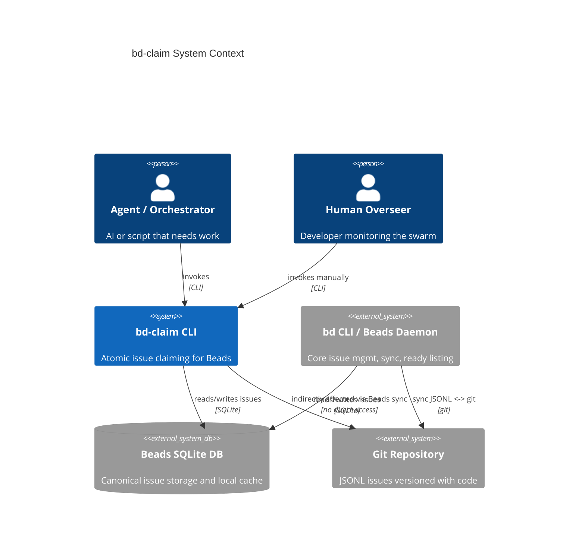

## 5. System Context Diagram (Mermaid)

```mermaid
C4Context
  title bd-claim System Context

  Person(agent, "Agent / Orchestrator", "AI or script that needs work")
  Person(human, "Human Overseer", "Developer monitoring the swarm")

  System(bdclaim, "bd-claim CLI", "Atomic issue claiming for Beads")

  System_Ext(beadsCli, "bd CLI / Beads Daemon", "Core issue mgmt, sync, ready listing")
  SystemDb_Ext(beadsDb, "Beads SQLite DB", "Canonical issue storage and local cache")
  System_Ext(gitRepo, "Git Repository", "JSONL issues versioned with code")

  Rel(agent, bdclaim, "invokes", "CLI")
  Rel(human, bdclaim, "invokes manually", "CLI")

  Rel(bdclaim, beadsDb, "reads/writes issues", "SQLite")
  Rel(beadsCli, beadsDb, "reads/writes issues", "SQLite")
  Rel(beadsCli, gitRepo, "sync JSONL <-> git", "git")
  Rel(bdclaim, gitRepo, "indirectly affected via Beads sync", "no direct access")

  UpdateLayoutConfig($c4ShapeInRow="3")
```
