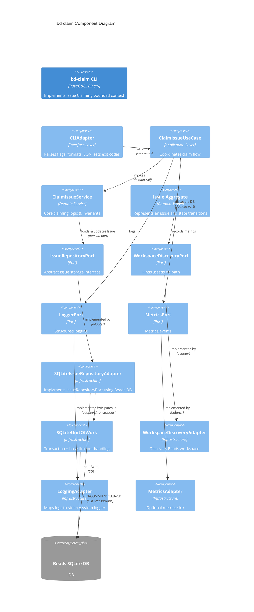

## 6. Component Diagram (C4 Level 2–3, Mermaid)

```mermaid
C4Component
  title bd-claim Component Diagram

  Container(bdclaim, "bd-claim CLI", "Rust/Go/… Binary", "Implements Issue Claiming bounded context")

  Component(cliAdapter, "CLIAdapter", "Interface Layer", "Parses flags, formats JSON, sets exit codes")
  Component(appService, "ClaimIssueUseCase", "Application Layer", "Coordinates claim flow")
  Component(domainService, "ClaimIssueService", "Domain Service", "Core claiming logic & invariants")
  Component(issueAgg, "Issue Aggregate", "Domain Model", "Represents an issue and state transitions")
  Component(repoPort, "IssueRepositoryPort", "Port", "Abstract issue storage interface")
  Component(workspacePort, "WorkspaceDiscoveryPort", "Port", "Finds .beads db path")
  Component(loggerPort, "LoggerPort", "Port", "Structured logging")
  Component(metricsPort, "MetricsPort", "Port", "Metrics/events")

  Component(sqliteRepo, "SQLiteIssueRepositoryAdapter", "Infrastructure", "Implements IssueRepositoryPort using Beads DB")
  Component(sqliteUoW, "SQLiteUnitOfWork", "Infrastructure", "Transaction + busy timeout handling")
  Component(workspaceAdapter, "WorkspaceDiscoveryAdapter", "Infrastructure", "Discovers Beads workspace")
  Component(loggingAdapter, "LoggingAdapter", "Infrastructure", "Maps logs to stderr/system logger")
  Component(metricsAdapter, "MetricsAdapter", "Infrastructure", "Optional metrics sink")

  Rel(cliAdapter, appService, "calls", "in-process")
  Rel(appService, domainService, "invokes", "domain call")
  Rel(domainService, repoPort, "loads & updates Issue", "domain port")
  Rel(appService, workspacePort, "discovers DB", "domain port")
  Rel(appService, loggerPort, "logs", "")
  Rel(appService, metricsPort, "records metrics", "")

  Rel(sqliteRepo, sqliteUoW, "participates in", "transactions")
  Rel(repoPort, sqliteRepo, "implemented by", "adapter")
  Rel(workspacePort, workspaceAdapter, "implemented by", "adapter")
  Rel(loggerPort, loggingAdapter, "implemented by", "adapter")
  Rel(metricsPort, metricsAdapter, "implemented by", "adapter")

  SystemDb_Ext(beadsDb, "Beads SQLite DB", "DB", "Shared with bd CLI & daemon")

  Rel(sqliteRepo, beadsDb, "read/write", "SQL")
  Rel(sqliteUoW, beadsDb, "BEGIN/COMMIT/ROLLBACK", "SQL transactions")
```
